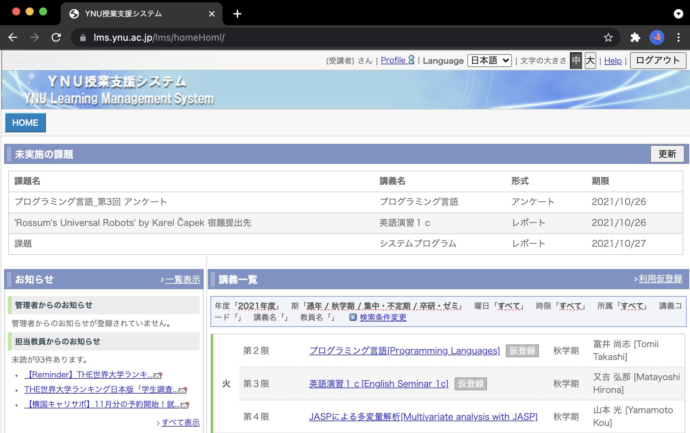
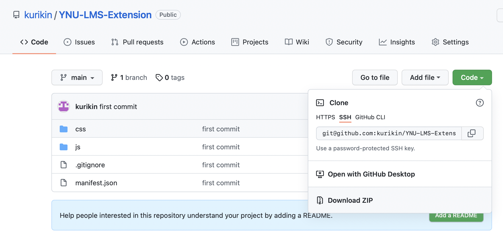
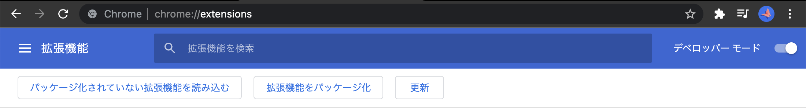
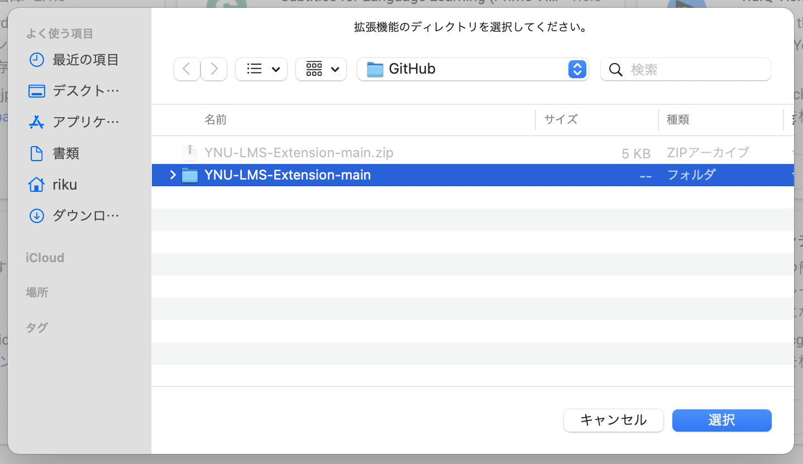

# YNU-LMS-Extension

未実施の課題・テスト情報を取得して、LMSに一覧表示するChrome拡張です。

## 導入方法（Mac / Win 共通）
1. 右上にある緑色の`Code`ボタンを押したあと、`Download ZIP`をクリック

2. ZIPファイルを自分の好きな場所にダウンロードし、解凍する
3. Google Chromeを起動して、`拡張機能の管理ページ`（chrome://extensions） にアクセス
4. 右上にある`デベロッパーモード`をONにして、`パッケージ化されていない拡張機能を読み込む`をクリック

5. `ステップ2`で解凍したフォルダを選択する

6. 拡張機能の一覧に、`YNU-LMS Extension`が追加されていれば成功です

## 注意事項
大学非公式のツールです。自己責任で使用してください。

## バグ報告やご要望
作者のTwitter(@_kurikin)へお気軽にどうぞ。
DMでもメンションでも大丈夫です。
